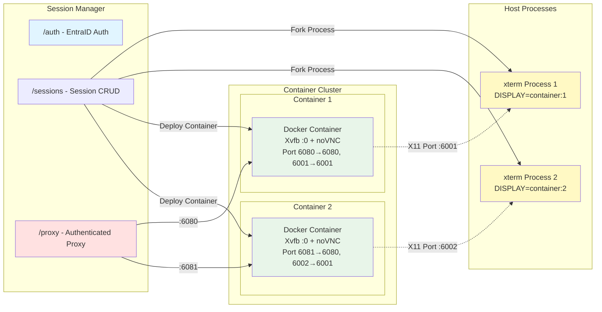
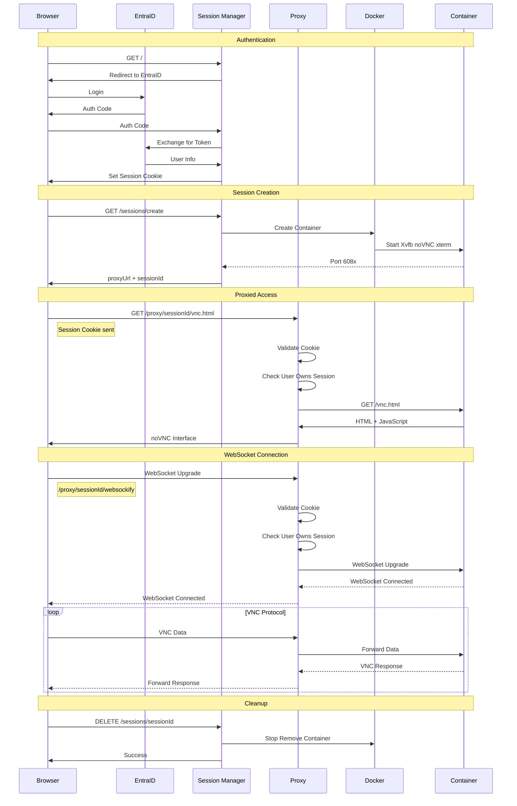

# X11-to-HTML Bridge

A secure web-based solution for accessing X11 applications through a browser using noVNC. Users authenticate via Azure EntraID and get isolated Docker containers running X11 sessions accessible through an authenticated proxy.

## Architecture



## Request Flow



## Components

### Session Manager (`/session-manager`)
Node.js/Express application providing:
- **Authentication**: Azure EntraID integration
- **Session Management**: Create, list, destroy user sessions
- **Container Orchestration**: Docker API integration
- **Authenticated Proxy**: HTTP and WebSocket proxy with session validation
- **Admin Interface**: View all active sessions

### X11 Web Bridge (`/x11-web-bridge`)
Docker image containing:
- **Xvfb**: Virtual X11 display server
- **noVNC**: HTML5 VNC client (websockify + web interface)
- **xterm**: Sample X11 application
- **Supervisor**: Process management

## Quick Start

### Prerequisites
- Docker
- Node.js 18+
- Azure EntraID app registration

### Configuration

Create `/session-manager/.env`:
```env
# Azure EntraID
TENANT_ID=your-tenant-id
CLIENT_ID=your-client-id
CLIENT_SECRET=your-client-secret
REDIRECT_URI=http://localhost:3000/auth/redirect

# Session
SESSION_SECRET=your-random-secret
PORT=3000

# Admin users (comma-separated emails)
ADMIN_USERS=admin@example.com
```

### Run

```bash
# Build Docker image
cd x11-web-bridge
docker build -t x11-web-bridge .

# Install and start session manager
cd ../session-manager
npm install
npm start
```

Navigate to `http://localhost:3000`

## Security Features

- ✅ **EntraID Authentication**: Enterprise SSO integration
- ✅ **Session Cookie Validation**: All requests authenticated
- ✅ **User Ownership Check**: Users can only access their own sessions
- ✅ **Isolated Containers**: Each session runs in separate Docker container
- ✅ **Automatic Cleanup**: Containers removed when sessions destroyed
- ✅ **No Direct Container Access**: All access through authenticated proxy

## API Endpoints

### Authentication
- `GET /` - Landing page / redirect to dashboard
- `GET /auth/signin` - Initiate EntraID login
- `GET /auth/redirect` - EntraID callback
- `GET /auth/signout` - Logout

### Sessions (Requires Auth)
- `GET /sessions` - List user's sessions
- `GET /sessions/create` - Create new session (SSE)
- `GET /sessions/:id` - Get session details
- `DELETE /sessions/:id` - Destroy session

### Proxy (Session Cookie Auth)
- `GET /proxy/:sessionId/*` - HTTP proxy to container
- `WebSocket /proxy/:sessionId/websockify` - WebSocket proxy

### Admin (Requires Admin Role)
- `GET /admin` - Admin dashboard
- `GET /admin/sessions` - All sessions
- `DELETE /admin/sessions/:id` - Force delete any session

## Development

### Session Manager
```bash
cd session-manager
npm install
npm start
```

### X11 Web Bridge
```bash
cd x11-web-bridge
docker build -t x11-web-bridge .

# Test directly
docker run -p 6080:6080 x11-web-bridge
# Access at http://localhost:6080/vnc.html
```

## Project Structure

```
x11-to-html/
├── session-manager/           # Node.js session management
│   ├── config/               # MSAL configuration
│   ├── middleware/           # Auth middleware
│   ├── routes/              # API routes
│   │   ├── auth.js          # EntraID authentication
│   │   ├── sessions.js      # Session CRUD
│   │   ├── proxy.js         # Authenticated proxy
│   │   └── admin.js         # Admin functions
│   ├── services/            
│   │   └── sessionManager.js # Docker orchestration
│   ├── views/               # EJS templates
│   └── public/              # Static assets
│
└── x11-web-bridge/           # Docker image
    ├── Dockerfile
    ├── supervisord.conf     # Process management
    └── scripts/             # Startup scripts
```

## Container Lifecycle

1. **Create**: User requests new session
2. **Start**: Docker starts container with unique port mapping
3. **Run**: Container runs Xvfb, noVNC, and xterm
4. **Access**: User connects via authenticated proxy
5. **Monitor**: Session manager tracks xterm process
6. **Cleanup**: Container stopped/removed on:
   - User delete request
   - xterm process exit
   - Server shutdown

## License

MIT
