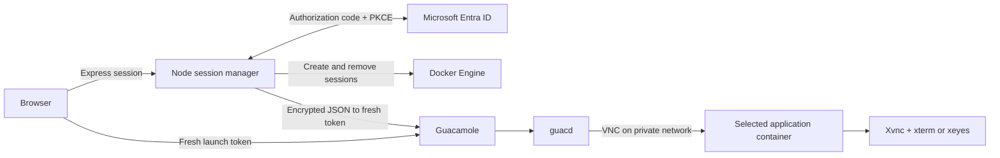

# X11-to-HTML with Apache Guacamole

A web-based gateway for containerized X11 applications. Users authenticate with
Microsoft Entra ID, choose an allowlisted application image, and access its
private Xvnc display through Apache Guacamole.

## Architecture


```mermaid
flowchart LR
    B[Browser] -->|Express session| N[Node session manager]
    N <-->|Authorization code + PKCE| E[Microsoft Entra ID]
    N -->|Create and remove sessions| D[Docker Engine]
    N -->|Encrypted JSON to fresh token| G[Guacamole]
    B -->|Fresh launch token| G
    G --> Q[guacd]
    Q -->|VNC on private network| X[Selected application container]
    X --> A[Xvnc + xterm or xeyes]
```

The Node application is the control plane. It owns authentication, authorization,
application-image selection, container lifecycle, and cleanup. Guacamole and
`guacd` provide the browser remote-display data plane.

## Session lifecycle

1. The user signs in through Microsoft Entra ID. The session manager uses the
   authorization-code flow with PKCE and records the returned account identity
   in its Express session.
2. The dashboard synchronously opens a dedicated popup window. It measures the
   popup's usable viewport and sends those dimensions to the session manager
   while receiving creation progress through Server-Sent Events.
3. The manager validates the requested application against its fixed `xterm`
   and `xeyes` allowlist, then launches the corresponding image. The container
   runs both the selected application and Xvnc at the measured browser
   resolution.
4. After the containerized application is ready, the popup requests
   `/sessions/:sessionId/launch`. The manager verifies ownership, signs and
   encrypts a short-lived Guacamole connection definition, and exchanges it
   server-side for a fresh Guacamole authentication token.
5. The popup is redirected to the dynamic Guacamole client. `guacd` connects to
   Xvnc over the private Docker network and Guacamole carries display, keyboard,
   pointer, and clipboard traffic between Xvnc and the browser.
6. Deleting the session, closing the containerized application, or shutting
   down the manager stops and removes the application container.

## Security model

- Entra ID protects the session manager. The authorization-code flow uses PKCE,
  and application routes rely on an HTTP-only Express session cookie.
- All user session routes require authentication. Read, launch, and delete
  operations compare the session owner with the signed-in Entra account ID.
- Each user session runs in a separate, uniquely named Docker container created
  from a server-side allowlisted image. Client input can never select an
  arbitrary image or executable.
- VNC is never published to the host; `guacd` reaches it through the private
  `x11-guacamole` Docker network.
- Every VNC server has a random per-session password. It is retained only by the
  control plane and included inside the encrypted Guacamole connection data.
- Application containers have no SSH server, host port publication, or
  host-mounted Docker socket. They join only the internal Guacamole network.
- Guacamole connections are supplied through signed, AES-encrypted JSON with a
  short expiry. The HMAC-SHA256 signature detects modification, and AES-128-CBC
  protects the connection parameters using the shared JSON secret.
- Every launch performs a new server-side token exchange. The fresh token in
  the redirect overrides any older Guacamole token cached by the browser.
- Dynamic Guacamole identities are anonymous so each popup keeps its token in
  window memory instead of sharing and revoking tokens through browser local
  storage. Entra identity and ownership are enforced before token issuance.
- Guacamole's IP-based login ban is disabled because signed JSON is the only
  authentication source and all local clients share one Docker gateway address;
  otherwise stale tokens could deny service to every valid session.
- Browser-facing session responses exclude VNC credentials and internal
  Guacamole connection parameters.
- Guacamole is published only on `127.0.0.1:8080`.
- The admin dashboard requires an exact email match in `ADMIN_USERS`.
- Session deletion removes the application container and its in-memory
  ownership record.

### Deployment boundary

The default configuration is intended for local development under WSL and
Docker Desktop. Before exposing it beyond the local machine:

- Terminate HTTPS at a trusted reverse proxy and configure secure proxy/cookie
  settings.
- Set a strong `SESSION_SECRET`; never rely on the development fallback.
- Replace Express's in-memory session store with a production session store.
- Change session creation to a state-changing HTTP method and add CSRF
  protection to create/delete operations.
- Prevent Guacamole launch URLs and their tokens from being written to access
  logs, analytics, browser telemetry, or referrer destinations.
- Review VNC credential strength and Xvnc's `-ac` setting for the intended
  multi-tenant threat model.
- Protect `GUACAMOLE_JSON_SECRET`: possession of this shared secret allows a
  caller to mint trusted dynamic Guacamole connection definitions.

## Prerequisites

- Node.js 18 or newer
- Docker with Docker Compose
- Microsoft Entra ID application registration

## Setup

1. Configure the application:

   ```bash
   cp session-manager/.env.example session-manager/.env
   ```

   Set the Entra ID client secret and session secret. The Guacamole startup
   script generates `GUACAMOLE_JSON_SECRET` if it is missing.

2. Build the shared base and application images:

   ```bash
   ./build-images.sh
   ```

3. Start Guacamole:

   ```bash
   ./start-guacamole.sh
   ```

4. Install and start the session manager:

   ```bash
   cd session-manager
   npm install
   npm start
   ```

5. Open `http://localhost:3000`.

Guacamole is bound to `http://localhost:8080` and is normally entered through
the authenticated session launch endpoint. The browser is redirected with a
fresh Guacamole token only after the backing session is ready.

Application containers join only the internal `x11-guacamole` network. VNC is
never published to the host; `guacd` is the only component that connects to it.

## Components

### `session-manager/`

- Express and EJS web application
- Microsoft MSAL/Entra ID authentication
- Docker session orchestration
- Server-Sent Events creation progress
- Popup sizing and delayed launch
- Allowlisted application-image selection
- Guacamole encrypted JSON generation and fresh-token exchange
- User and administrator session controls

### `x11-web-bridge/`

- Shared TigerVNC/Xvnc base image
- Supervisor and application lifecycle
- No application or externally published service

### `x11-apps/`

- `xterm` image for terminal sessions
- `xeyes` image for XEyes sessions
- Thin application-specific layers over `x11-web-base`

### `docker-compose.guacamole.yml`

- Apache Guacamole 1.6.0 web application
- `guacd` protocol proxy
- Private external Docker network shared with session containers

## Main endpoints

- `GET /auth/login` - start Entra ID authentication
- `GET /auth/callback` - authentication callback
- `GET /dashboard` - user session dashboard
- `GET /sessions` - list the current user's sessions
- `GET /sessions/create` - create a session with SSE progress
- `GET /sessions/:id/launch` - authorize and redirect to a fresh Guacamole client
- `GET /sessions/:id` - retrieve session status
- `DELETE /sessions/:id` - destroy a session
- `GET /admin` - administrator dashboard
- `GET /admin/sessions/:id/launch` - launch a session as an administrator

## Development checks

```bash
cd session-manager
npm test
```

## License

MIT
