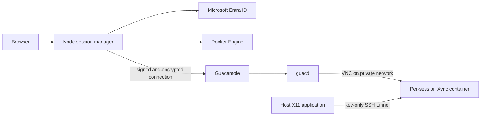

# X11-to-HTML with Apache Guacamole

A web-based gateway for host X11 applications. Users authenticate with
Microsoft Entra ID, receive an isolated Xvnc container, and access the display
through Apache Guacamole.

## Architecture


```mermaid
flowchart LR
    B[Browser] --> N[Node session manager]
    N --> E[Microsoft Entra ID]
    N --> D[Docker Engine]
    N -->|signed and encrypted connection| G[Guacamole]
    G --> Q[guacd]
    Q -->|VNC on private network| X[Per-session Xvnc container]
    H[Host X11 application] -->|key-only SSH tunnel| X
```

The Node application is the control plane. It owns authentication, authorization,
container creation, host process startup, and cleanup. Guacamole and `guacd`
provide the browser remote-display data plane.

## Security model

- Entra ID protects the session manager.
- Each user session runs in a separate Docker container.
- VNC is never published to the host; `guacd` reaches it through the private
  `x11-guacamole` Docker network.
- Every VNC server has a random per-session password supplied only to Guacamole.
- Host X11 traffic uses an ephemeral Ed25519 key and loopback-only SSH tunnel.
- Guacamole connections are supplied through signed, AES-encrypted JSON with a
  short expiry.
- Session deletion removes the container, SSH process, xterm process, and
  temporary credentials.

## Prerequisites

- Node.js 18 or newer
- Docker with Docker Compose
- OpenSSH client tools and `xterm`
- Microsoft Entra ID application registration

## Setup

1. Configure the application:

   ```bash
   cp session-manager/.env.example session-manager/.env
   ```

   Set the Entra ID client secret and session secret. The Guacamole startup
   script generates `GUACAMOLE_JSON_SECRET` if it is missing.

2. Build the display image:

   ```bash
   docker build -t x11-web-bridge x11-web-bridge
   ```

3. Start Guacamole:

   ```bash
   ./start-guacamole.sh
   ```

4. Install and start the session manager:

   ```bash
   cd session-manager
   npm install
   npm start
   ```

5. Open `http://localhost:3000`.

Guacamole is bound to `http://localhost:8080` and is normally entered through a
short-lived URL generated by the session manager.

Docker Desktop requires the per-session container to have a host-access network
for its loopback SSH publication. The manager creates a unique network for this
purpose and removes it with the session. VNC remains available only on the
container networks and is never published to the host; `guacd` reaches it through
the separate internal `x11-guacamole` network.

## Components

### `session-manager/`

- Express and EJS web application
- Microsoft MSAL/Entra ID authentication
- Docker session orchestration
- Server-Sent Events creation progress
- Guacamole encrypted JSON connection generation
- User and administrator session controls

### `x11-web-bridge/`

- TigerVNC/Xvnc display server
- Key-only OpenSSH endpoint
- Supervisor process management
- Host X11 helper scripts

### `docker-compose.guacamole.yml`

- Apache Guacamole 1.6.0 web application
- `guacd` protocol proxy
- Private external Docker network shared with session containers

## Main endpoints

- `GET /auth/login` - start Entra ID authentication
- `GET /auth/callback` - authentication callback
- `GET /dashboard` - user session dashboard
- `GET /sessions` - list the current user's sessions
- `GET /sessions/create` - create a session with SSE progress
- `GET /sessions/:id` - retrieve a session and fresh Guacamole URL
- `DELETE /sessions/:id` - destroy a session
- `GET /admin` - administrator dashboard

## Development checks

```bash
cd session-manager
npm test
```

## License

MIT
