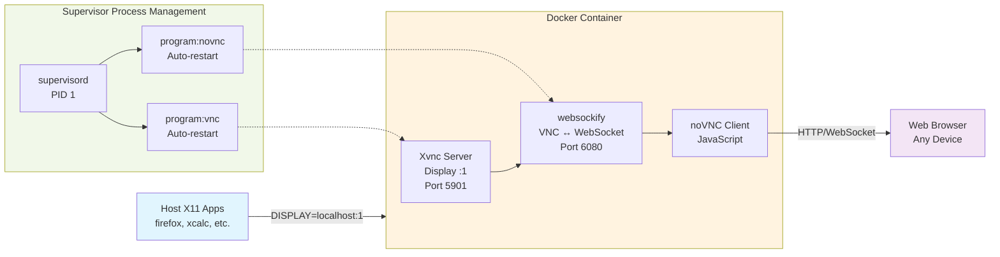

# X11 Web Bridge

Run X11 applications from your host machine and display them in your web browser using Docker + TigerVNC + noVNC.

## Quick Start

```bash
# 1. Start the X11 display server
1. **Start the X11 display server**:
   ```bash
   ./start-display.sh 1920x1080
   ```

# 2. Run X11 applications on your host machine
./run-x11-app.sh xcalc                     # Calculator
./run-x11-app.sh firefox fullscreen       # Firefox in kiosk mode
./run-fullscreen.sh firefox           # Dedicated fullscreen script

# 3. Access via web browser
# URL: http://localhost:6080/vnc.html
# Password: vncpass
```

*Requires Docker and Docker Compose*

## Features

✅ **Host-based X Clients** - Run applications on your host machine  
✅ **Containerized Display** - X11 display server runs in Docker  
✅ **Web Access** - View and interact through any web browser  
✅ **Clean Interface** - No desktop environment, just your applications

## Fullscreen Applications

```bash
# Run apps in fullscreen/kiosk mode
./run-fullscreen.sh firefox           # Firefox kiosk mode
./run-fullscreen.sh chromium          # Chromium kiosk mode
./run-fullscreen.sh code              # VS Code fullscreen

# Or use regular script with fullscreen flag
./run-x11-app.sh firefox fullscreen

# Change display resolution
./set-resolution.sh 1920x1080         # Full HD
./set-resolution.sh 2560x1440         # 2K resolution
```

## Manual Usage

```bash
# Start X11 display server
./start-display.sh [resolution]

# Run applications on host
export DISPLAY=localhost:1
firefox --kiosk &                     # Fullscreen Firefox
xcalc &

# Or use helper scripts
./run-x11-app.sh xcalc
./run-fullscreen.sh firefox

# Stop container  
docker-compose down

# Check status
./status.sh
```

## How It Works

1. **Docker Container** provides the X11 display server (Xvnc)
2. **Host Applications** connect to `DISPLAY=localhost:1`  
3. **noVNC** streams the display to your web browser
4. **You interact** with host apps through the browser

## Architecture



## Files

- `start-display.sh` - Start X11 display server container
- `run-x11-app.sh` - Helper to run X11 apps on host
- `run-fullscreen.sh` - Run apps in fullscreen/kiosk mode
- `set-resolution.sh` - Change display resolution
- `Dockerfile` - Container definition with Xvnc server
- `docker-compose.yml` - Container configuration
- `status.sh` - Monitor running services