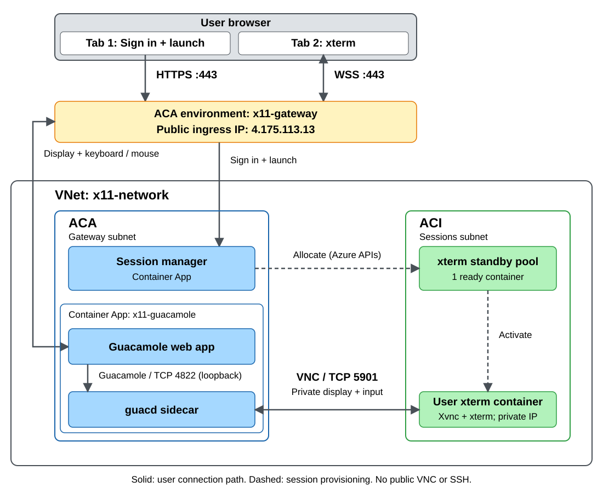

# Azure deployment architecture

This document describes the Azure deployment inspected on **2026-10-06**, in
resource group `x11-sessions-rg`, region `westeurope`. The required application is
**xterm**; no xeyes standby pool or running xeyes container is required.

This is an inventory of the existing deployment and its recovery procedure,
not a complete fresh-install guide. The Azure session-manager image contains
ACI and Table Storage integrations that are **not present in the local Docker
session-manager source in this checkout**. Do not build that local source and
use it to replace the deployed Azure session manager.

## Architecture diagram

Both the ACA environment and the ACI containers use the same VNet, in separate
subnets. The diagram groups the standby pool with the ACI containers it manages;
the pool itself is an Azure management resource, not a network endpoint in the
subnet. Solid arrows show application traffic; dotted arrows show lifecycle
management through Azure APIs.



[Open full-size diagram](architecture.svg) |
[Editable Excalidraw source](architecture.excalidraw)

The two ACA apps are `x11-session-manager` and `x11-guacamole` (which includes
the guacd sidecar). The ACI pool supplies ready containers for user sessions;
the manager controls their activation and lifecycle and supplies Guacamole
connection tokens. All ACI containers have private IPs in the sessions subnet.

The user connection path is:

1. **Browser to session manager: HTTPS, TCP 443** for sign-in, session creation,
   and the authorized launch redirect.
2. **Browser to Guacamole: HTTPS / WSS, TCP 443** for the web client and secure
   WebSocket tunnel carrying display, keyboard, mouse, and clipboard traffic.
   Guacamole also supports an HTTP tunnel fallback over HTTPS.
3. **Guacamole to guacd: Guacamole protocol, TCP 4822 on loopback**, inside the
   same Container App. **guacd to Xvnc: VNC/RFB, TCP 5901** over the private VNet.
   Xvnc hosts xterm's X11 display inside the ACI container.

The session manager does not relay the user's display traffic, and the browser
does not connect directly to ACI, VNC, or SSH. ACA terminates the public TLS
connection and forwards to the manager on port 3000 or Guacamole on port 8080.

The browser box shows two logical tabs: **sign-in/launch** and **xterm** (the
application opens the terminal in a separate popup window). A VNet itself has
no public IP. **Public ingress `4.175.113.13` belongs to the `x11-gateway` ACA
environment**. Both browser paths pass through that environment ingress,
using the application HTTPS hostnames to route to the appropriate app.
The address was checked on 2026-10-06.

This use case requires no xterm access outside the VNet, so outbound NAT is
omitted from the diagram. The deployed NAT resources are still listed in the
inventory below; changing this diagram does not remove them or enforce an
outbound network restriction.

Entra ID, Table Storage/private endpoint, ACR, managed identities, the container
group profile, NSG, NAT Gateway, private DNS, and Log Analytics are detailed
below rather than crowding the diagram.

## Components

| Component | Azure resource | Purpose and observed configuration |
|---|---|---|
| Session manager | Container App `x11-session-manager` | Entra-authenticated control plane; ACI lifecycle and session persistence. Public HTTPS ingress targets port 3000. Minimum and maximum replicas are both 1. |
| Remote display gateway | Container App `x11-guacamole` | Runs Guacamole and guacd together. Public HTTPS ingress targets Guacamole on port 8080; `GUACD_HOSTNAME=127.0.0.1`. Minimum and maximum replicas are both 1. |
| Container Apps environment | `x11-gateway` | VNet-integrated environment in the `gateway` subnet, using the Consumption workload profile and Log Analytics. |
| Application sessions | Azure Container Instances | Private Linux containers running Xvnc and xterm, reachable over VNC on TCP 5901. Container names and private IPs are dynamic. |
| Standby pool | `x11-xterm-pool` | Keeps one ready xterm container, with `refillPolicy=always`, using profile revision 2. |
| Standby specification | Container group profile `x11-xterm-standby` | Uses `x11-app-xterm:standby-v1`, 1 vCPU, and 1.5 GiB requested memory. A standby entrypoint waits for session activation; readiness checks use standby/application marker files. |
| Image registry | ACR `x112q25qu3t7o3dm` | Stores the Azure manager, xterm/base images, and mirrored Guacamole/guacd images. Login server: `x112q25qu3t7o3dm.azurecr.io`. |
| Session persistence | Storage account `x112q25qu3t7o3dmsessions` | Table endpoint configured through `SESSION_TABLE_ENDPOINT`. Public network access is disabled. |
| Storage private access | Private endpoint `x11-tables` and private DNS zone `privatelink.table.core.windows.net` | Private Table Storage connectivity and name resolution from the VNet. |
| Network isolation | VNet `x11-network` and NSG `x11-sessions` | Separates gateway, session containers, and storage private endpoint. |
| Session outbound access | NAT Gateway `x11-nat`, public IP `x11-outbound` | Outbound connectivity for the ACI session subnet; does not publish inbound VNC. |
| Image-pull identity | User-assigned identity `x11-image-pull` | Used for ACI image access where configured; retained identity/operator permissions also support standby provisioning. The existing standby profile uses registry credentials. |
| Control-plane identity | User-assigned identity `x11-session-manager` | ACI contributor, standby pool contributor, subnet network contributor, image-pull identity operator, and Storage Table Data Contributor permissions. |
| User authentication | Microsoft Entra ID application registration | Browser sign-in for the session manager. The Entra application and the manager's Azure managed identity have different purposes. |
| Logging | Log Analytics workspace `x11-logs` | Container Apps application logs, with 30-day retention. |
| Storage event infrastructure | Event Grid system topic associated with the storage account | Present in the resource inventory; its application-level use was not established during inspection. |

The existing xeyes registry image and `x11-xeyes-standby` profile remain in
Azure. The recovery deployment leaves them untouched and creates no xeyes pool
or container. It does not remove xeyes from the deployed application's UI or
allowlist.

### Deployed images at inspection

| Workload | Image |
|---|---|
| Session manager | `x112q25qu3t7o3dm.azurecr.io/session-manager:manager-20261002124214` |
| Guacamole | `x112q25qu3t7o3dm.azurecr.io/guacamole/guacamole:1.6.0` |
| guacd | `x112q25qu3t7o3dm.azurecr.io/guacamole/guacd:1.6.0` |
| xterm standby/application | `x112q25qu3t7o3dm.azurecr.io/x11-app-xterm:standby-v1` |

## Session flow

1. The user signs into the session manager through Entra ID and requests xterm
   with the browser window's display dimensions.
2. The deployed manager uses `SESSION_RUNTIME=aci` and
   `ACI_STANDBY_ENABLED=true`. Its `ACI_STANDBY_PROFILES` configuration points
   xterm at the existing profile, revision, and pool.
3. The standby pool supplies pre-provisioned capacity. The application image's
   standby entrypoint supports activation using the configured activation key;
   a ready standby container is not yet a user's running terminal.
4. The manager records session state through the private Table Storage endpoint
   and authorizes access to each user's session.
5. The manager exchanges signed, encrypted connection data for a fresh Guacamole
   token. The browser then opens the Guacamole client.
6. Guacamole's guacd sidecar connects to the session's private VNC endpoint.
   Display and input travel through Guacamole, not a public VNC port.
7. Session termination removes the allocated application container. The pool's
   refill policy replenishes ready capacity.

The deployed manager's ACI allocation and activation implementation cannot be
audited from this checkout; the flow above reflects its deployed configuration,
the saved standby template, and the gateway architecture.

## Network and secret boundaries

| Subnet | Range | Configuration |
|---|---|---|
| `gateway` | `10.42.0.0/23` | Delegated to `Microsoft.App/environments`. |
| `sessions` | `10.42.2.0/24` | Delegated to `Microsoft.ContainerInstance/containerGroups`; associated with the session NSG and NAT Gateway. |
| `storage` | `10.42.3.0/24` | Hosts the Table Storage private endpoint. |

The session NSG permits inbound TCP 5901 from the gateway subnet at priority
100 and denies other inbound traffic at priority 200. Guacamole and the manager
have public HTTPS ingress with insecure HTTP disabled. Storage is private-only.
NAT provides outbound access, so private session addressing does not imply
outbound internet isolation.

Container App secret references hold the Entra client secret, Express session
secret, shared Guacamole JSON secret, and standby activation key. The Guacamole
and manager JSON secrets must match. Never commit secret values, print them in
deployment logs, or include Guacamole launch tokens in access logs.

## Deployment files and retained templates

### Files available in this checkout

| File | Scope |
|---|---|
| [`xterm-standby.json`](xterm-standby.json) | ARM recovery template for the xterm standby pool only. Reuses an existing profile revision and session subnet. |
| [`../build-images.sh`](../build-images.sh) | Local Docker image builds for the base, xterm, and xeyes; not an Azure build/push script and not xterm-only. |
| [`../start-guacamole.sh`](../start-guacamole.sh) | Local Guacamole startup and shared-secret setup. |
| [`../docker-compose.guacamole.yml`](../docker-compose.guacamole.yml) | Local Guacamole/guacd deployment; not an Azure deployment template. |

### Templates retained in Azure deployment history

| Deployment name | Role |
|---|---|
| `x11-infra` | Existing foundational Azure infrastructure deployment. |
| `session-manager` | Existing Azure session-manager deployment. |
| `standby-pools` | Original profiles, standby service permissions, and pools for both xterm and xeyes. Replaying it unchanged would include xeyes. |
| `standby-registry` | Existing deployment associated with standby registry setup. |
| `xterm-standby` | Xterm-only recovery deployment using this checkout's template. |

The original full templates and Azure build/deployment scripts are not tracked
in this checkout. Azure-retained templates can be exported for inspection:

```bash
az deployment group list \
  --resource-group x11-sessions-rg \
  --query '[].{name:name,state:properties.provisioningState}' --output table

az deployment group export \
  --resource-group x11-sessions-rg \
  --name x11-infra
```

Repeat export for the other deployment names as needed. Secure parameter values
are not recovered by exporting a deployment template. Exported templates still
need review for embedded sensitive values, dependency ordering, parameter
sources, and application/image availability before reuse or committing.

## Restore the xterm pool

Use Azure CLI with the intended subscription selected. These commands assume
the existing profile, network, registry images, secrets, and permissions have
already been deployed in `x11-sessions-rg`.

```bash
az account show --query '{subscription:name,id:id}' --output table

revision=$(az resource show \
  --resource-group x11-sessions-rg \
  --resource-type Microsoft.ContainerInstance/containerGroupProfiles \
  --name x11-xterm-standby \
  --api-version 2025-09-01 \
  --query properties.revision --output tsv)

az deployment group what-if \
  --resource-group x11-sessions-rg \
  --name xterm-standby \
  --mode Incremental \
  --template-file azure/xterm-standby.json \
  --parameters profileRevision="$revision" capacity=1

az deployment group create \
  --resource-group x11-sessions-rg \
  --name xterm-standby \
  --mode Incremental \
  --template-file azure/xterm-standby.json \
  --parameters profileRevision="$revision" capacity=1
```

Run from the repository root. Review the what-if result before executing create.
Ensure the manager's xterm entry in `ACI_STANDBY_PROFILES` references the same
revision; deploying a pool does not update manager configuration.

Template parameters are `location` (resource-group location by default),
`prefix` (`x11` by default), `profileRevision` (required), and `capacity`
(default 1, allowed 0-5). The prefix determines the pool, profile, and VNet
names. Deployment is incremental: unrelated resources are not deleted.

## Start existing stopped web apps

Starting the existing Container Apps preserves their images and configuration;
it is not a fresh deployment.

```bash
subscription_id=$(az account show --query id --output tsv)
resource_base="https://management.azure.com/subscriptions/$subscription_id/resourceGroups/x11-sessions-rg/providers/Microsoft.App/containerApps"

az rest --method post \
  --url "$resource_base/x11-guacamole/start?api-version=2025-01-01"

az rest --method post \
  --url "$resource_base/x11-session-manager/start?api-version=2025-01-01"
```

## Operational checks

```bash
az containerapp list --resource-group x11-sessions-rg \
  --query '[].{name:name,status:properties.runningStatus,fqdn:properties.configuration.ingress.fqdn}' \
  --output table

subscription_id=$(az account show --query id --output tsv)
pool_url="https://management.azure.com/subscriptions/$subscription_id/resourceGroups/x11-sessions-rg/providers/Microsoft.StandbyPool/standbyContainerGroupPools/x11-xterm-pool"

az rest --method get \
  --url "$pool_url/runtimeViews/latest?api-version=2025-03-01" \
  --query properties

az container list --resource-group x11-sessions-rg \
  --query '[].{name:name,state:provisioningState,ip:ipAddress.ip}' \
  --output table

az containerapp logs show --resource-group x11-sessions-rg \
  --name x11-session-manager --type console --tail 50
```

A successful ARM deployment alone does not prove usable standby capacity.
Check pool health, the Running instance count, and application container logs
for `X11_STANDBY_READY`. Finally, sign in and launch an xterm session to verify
allocation, storage access, Guacamole token exchange, display, and keyboard
input end to end.

At the recovery check on 2026-10-06, both public endpoints returned HTTP 200,
the xterm pool reported healthy with one Running instance, and its container
logged `X11_STANDBY_READY`. An authenticated browser launch was not verified.

## Application URLs and cost considerations

- [Session manager](https://x11-session-manager.blackpebble-01ddd5d4.westeurope.azurecontainerapps.io/)
- [Guacamole](https://x11-guacamole.blackpebble-01ddd5d4.westeurope.azurecontainerapps.io/)

The standby pool maintains paid ready ACI capacity even when no user has a
terminal open. The two Container Apps are configured with a minimum of one
replica each. NAT Gateway, public IP, ACR, private endpoint, storage, and log
ingestion/retention can also incur charges.

Capacity can be redeployed as zero to stop maintaining ready standby capacity;
that is a behavioral change, not a guaranteed application shutdown. It does
not delete already allocated user sessions or stop the web apps.
